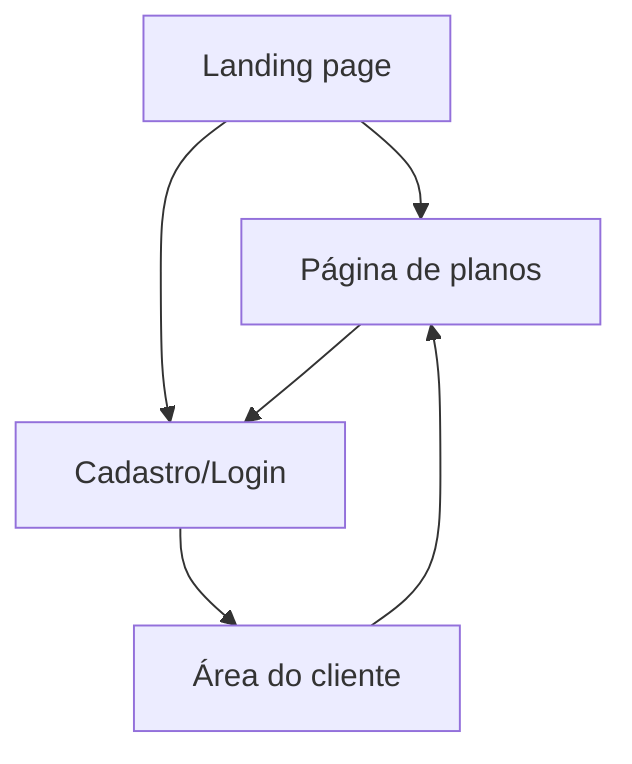

## 1. Product Overview

MEGA ERP é um SaaS de ERP focado em centralizar operações e dados do cliente em um painel simples.
Você apresenta o produto em uma landing page, oferece planos e permite acesso via cadastro/login à área do cliente.
Os planos são gerenciados no painel administrativo e exibidos no site via API (não ficam fixos no frontend).

## 2. Core Features

### 2.1 User Roles

| Role                  | Registration Method           | Core Permissions                                                        |
| --------------------- | ----------------------------- | ----------------------------------------------------------------------- |
| Visitante             | Sem cadastro                  | Navegar landing e ver planos; iniciar cadastro/login                    |
| Cliente (autenticado) | Email + senha (Supabase Auth) | Acessar área do cliente; ver/editar perfil; selecionar/visualizar plano |

### 2.2 Feature Module

Nossos requisitos consistem nas seguintes páginas principais:

1. **Landing page**: apresentação do MEGA ERP, benefícios, prova social, CTA para planos e login/cadastro.
2. **Página de planos**: comparação de planos, escolha de plano, CTA para criar conta/entrar.
3. **Cadastro/Login**: autenticação por email e senha (criar conta, entrar, recuperar senha).
4. **Área do cliente**: visão geral, dados do perfil, plano atual e ações básicas de conta.

### 2.3 Page Details

| Page Name        | Module Name           | Feature description                                                                      |
| ---------------- | --------------------- | ---------------------------------------------------------------------------------------- |
| Landing page     | Header + navegação    | Exibir links para Planos e Entrar/Cadastrar; manter CTA principal destacado              |
| Landing page     | Seção Hero            | Apresentar proposta de valor; CTA para “Ver planos” e “Criar conta”                      |
| Landing page     | Seções de conteúdo    | Explicar benefícios principais; exibir prova social/FAQ resumido; reforçar CTA final     |
| Página de planos | Lista/grade de planos | Exibir planos com preço, recursos e destaque do recomendado                              |
| Página de planos | Comparação            | Comparar recursos essenciais entre planos de forma escaneável                            |
| Página de planos | Seleção de plano      | Permitir selecionar um plano e direcionar para cadastro/login mantendo o plano escolhido |
| Cadastro/Login   | Cadastro              | Criar conta por email e senha; aceitar termos; tratar erros e validações básicas         |
| Cadastro/Login   | Login                 | Autenticar por email e senha; manter sessão; tratar erros                                |
| Cadastro/Login   | Recuperação de senha  | Solicitar email; acionar fluxo de reset; informar status ao usuário                      |
| Área do cliente  | Visão geral           | Mostrar boas-vindas, status da conta e acesso rápido ao perfil e plano                   |
| Área do cliente  | Perfil                | Exibir e permitir editar dados básicos (ex.: nome/empresa); salvar alterações            |
| Área do cliente  | Plano                 | Exibir plano atual; permitir trocar plano direcionando à página de planos                |
| Área do cliente  | Sessão                | Permitir logout; proteger rota exigindo autenticação                                     |

## 3. Core Process

**Fluxo do visitante (pré-login)**

1. Você entra na Landing page e entende a proposta do MEGA ERP.
2. Você acessa a Página de planos para comparar e escolher um plano.
3. Você clica em “Criar conta” e vai para Cadastro/Login (com o plano pré-selecionado, quando aplicável).

**Fluxo do cliente (autenticado)**

1. Você faz login e é direcionado para a Área do cliente.
2. Você confere o plano atual e, se necessário, troca de plano (voltando para Planos).
3. Você atualiza seu perfil e sai da conta quando quiser.

