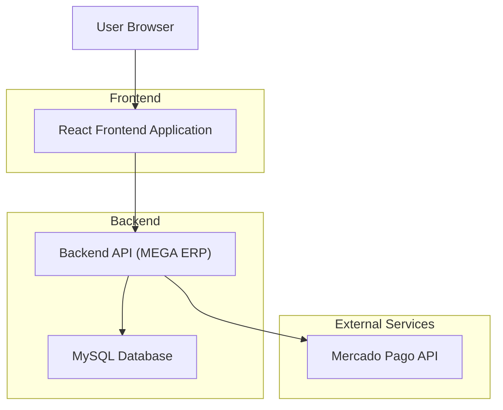
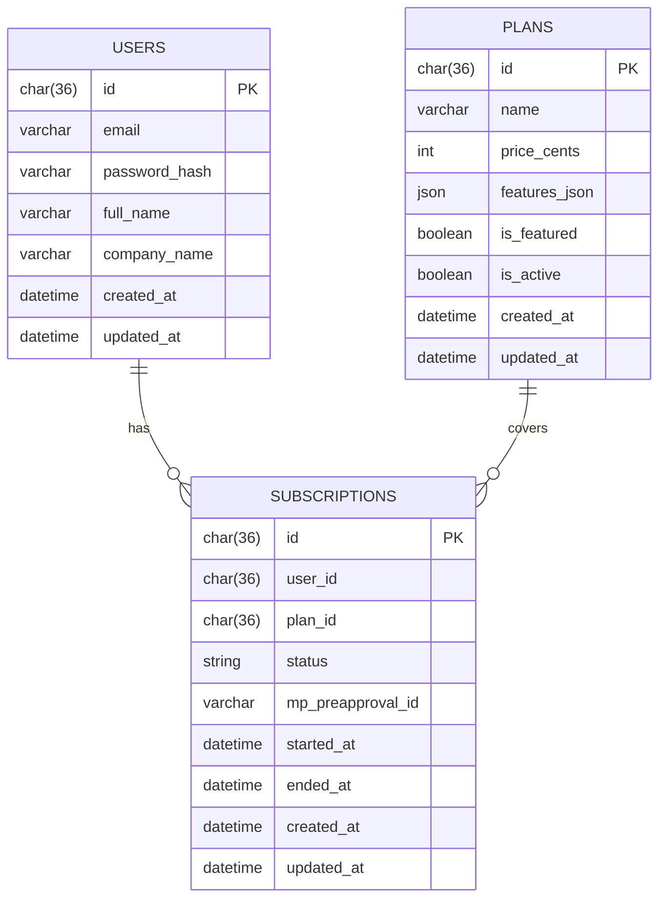

## 1. Architecture design


## 2. Technology Description
- Frontend: React@18 + Vite + TypeScript + TailwindCSS
- Backend: API própria (ex.: Node.js) + MySQL
- Auth: sessão via cookie seguro (HttpOnly) e rotas REST
- Pagamentos: Mercado Pago (checkout/assinatura)

## 3. Rotas do frontend
| Rota | Objetivo |
|------|----------|
| / | Landing page com apresentação e CTAs |
| /planos | Exibir e comparar planos; iniciar contratação |
| /auth | Cadastro, login e recuperação de senha |
| /app | Área do cliente (rota protegida) |
| /termos | Termos de uso |
| /privacidade | Política de privacidade |

## 4. Endpoints consumidos pelo frontend
| Endpoint | Uso |
|----------|-----|
| GET /api/public/plans | Listar planos ativos (vindos do painel admin) |
| POST /api/auth/register | Criar conta e iniciar sessão |
| POST /api/auth/login | Login e iniciar sessão |
| POST /api/auth/logout | Logout |
| GET /api/auth/me | Sessão e perfil |
| POST /api/auth/password/forgot | Recuperação de senha |
| PUT /api/me/profile | Atualizar perfil |
| GET /api/me/subscription | Assinatura atual do cliente |
| POST /api/billing/checkout | Iniciar checkout Mercado Pago e retornar initPoint |

## 5. Modelo de dados (MySQL)


## 6. DDL (referência MySQL)
```sql
CREATE TABLE users (
  id CHAR(36) PRIMARY KEY,
  email VARCHAR(255) NOT NULL UNIQUE,
  password_hash VARCHAR(255) NOT NULL,
  full_name VARCHAR(255) NOT NULL,
  company_name VARCHAR(255) NULL,
  created_at DATETIME NOT NULL,
  updated_at DATETIME NOT NULL
);

CREATE TABLE plans (
  id CHAR(36) PRIMARY KEY,
  name VARCHAR(255) NOT NULL,
  price_cents INT NOT NULL,
  features_json JSON NOT NULL,
  is_featured TINYINT(1) NOT NULL DEFAULT 0,
  is_active TINYINT(1) NOT NULL DEFAULT 1,
  created_at DATETIME NOT NULL,
  updated_at DATETIME NOT NULL
);

CREATE TABLE subscriptions (
  id CHAR(36) PRIMARY KEY,
  user_id CHAR(36) NOT NULL,
  plan_id CHAR(36) NOT NULL,
  status ENUM('active','canceled','past_due') NOT NULL,
  mp_preapproval_id VARCHAR(255) NULL,
  started_at DATETIME NOT NULL,
  ended_at DATETIME NULL,
  created_at DATETIME NOT NULL,
  updated_at DATETIME NOT NULL,
  CONSTRAINT fk_subscriptions_user FOREIGN KEY (user_id) REFERENCES users(id),
  CONSTRAINT fk_subscriptions_plan FOREIGN KEY (plan_id) REFERENCES plans(id)
);
```
